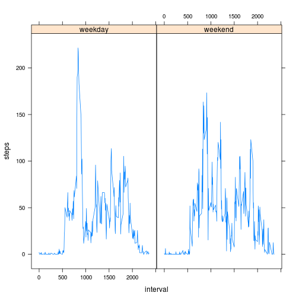

# Reproducible Research: Peer Assessment 1

Per the assignment description:  
"This assignment makes use of data from a personal activity monitoring device. This device collects data at 5 minute intervals through out the day. The data consists of two months of data from an anonymous individual collected during the months of October and November, 2012 and include the number of steps taken in 5 minute intervals each day."

## Loading and preprocessing the data

### Retrieving the data


```r
setwd('~/Reproducible/RepData_PeerAssessment1')
download.file(
  'http://d396qusza40orc.cloudfront.net/repdata/data/activity.zip',
  'activity.zip')
unzip('activity.zip', 'activity.csv')
activity <- read.csv('activity.csv')
```


## What is mean total number of steps taken per day?

Ignoring days with missing values for the number of steps, we can determine the distribution of the total number of steps in a given day, as well as calculate mean and median values.


```r
# Sum the 5 minute intervals for each day
dailyTotal<- rowsum(activity$steps, activity$date)

# Plot the distribution
hist(dailyTotal, 10, main = 'Total Number of Steps Taken Each Day')
```

 

```r
# Calculate some statistics
meanDailyTotal <- mean(dailyTotal[!is.na(dailyTotal)])
medianDailyTotal <- median(dailyTotal[!is.na(dailyTotal)])
print(c('The Mean Daily Total is:  ', meanDailyTotal))
```

```
## [1] "The Mean Daily Total is:  " "10766.1886792453"
```

```r
print(c('The Median Daily Total is:  ', medianDailyTotal))
```

```
## [1] "The Median Daily Total is:  " "10765"
```

The mean total number of steps taken per day is 10766.  
The median total number of steps taken per day is 10765.

## What is the average daily activity pattern?


```r
meanInterval <- aggregate(steps ~ interval, 
                          data= activity[!is.na(activity$steps),], 
                          mean)
plot(meanInterval, 
     type='l', 
     main='Average Daily Activity Pattern', 
     sub = 'Average Number of Steps per Day by Interval')
```

 

```r
maxInterval <- meanInterval[max(meanInterval$steps),]$interval
print(c('The Interval with the maximum daily average is:  ', maxInterval))
```

```
## [1] "The Interval with the maximum daily average is:  "
## [2] "1705"
```

The Interval with the maximum daily average of 206.1698 is 1705.

## Imputing missing values

Values for some intervals are missing and marked as NA.


```r
Missing <- length(activity[is.na(activity$steps),]$steps)
print(c('Number missing:  ', Missing))
```

```
## [1] "Number missing:  " "2304"
```

There are 2304 missing intervals in the data set.

Let's imput missing values using the median value of the interval for all days when the interval is non-missing.


```r
medianInterval <- aggregate(steps ~ interval, 
                            data= activity[!is.na(activity$steps),], 
                            median)
# Create a copy of the activity dataset
newActivity <- activity

#Impute values
newActivity[is.na(newActivity$steps),]$steps <- 
  medianInterval$steps[match(newActivity[is.na(newActivity$steps),]$interval, 
                             medianInterval$interval)]
```
Using imputed values for the values that were originally missing, we can determine the distribution of the total number of steps in a given day, as well as calculate mean and median values.


```r
# Sum the 5 minute intervals for each day
newDailyTotal<- rowsum(newActivity$steps, activity$date)

# Plot the distribution
hist(newDailyTotal, 10, 
     main = 'Total Number of Steps Taken Each Day (with imputed values')
```

 

```r
# Calculate some statistics
newMeanDailyTotal <- mean(newDailyTotal[!is.na(newDailyTotal)])
newMedianDailyTotal <- median(newDailyTotal[!is.na(newDailyTotal)])
print(c('The Imputed Mean Daily Total is:  ', newMeanDailyTotal))
```

```
## [1] "The Imputed Mean Daily Total is:  "
## [2] "9503.86885245902"
```

```r
print(c('The Imputed Median Daily Total is:  ', newMedianDailyTotal))
```

```
## [1] "The Imputed Median Daily Total is:  "
## [2] "10395"
```

The mean total number of steps taken per day after imputing missing values is 9504 compared to the mean total number of steps prior to imputation of 10766.  
The median total number of steps taken per day after imputing missing values is 10395 compared to the median total number of steps prior to the imputation of 10765


## Are there differences in activity patterns between weekdays and weekends?

Create a new column to indicae weekday and weekend.


```r
activity$weekpart <- 'weekday'
activity[weekdays(as.Date(activity$date)) %in% c('Sunday', 'Monday'),]$weekpart <- 'weekend'
```

Let's look at the average number of steps for each interval on weekdays vs. weekends.


```r
meanIntervalWeekpart1 <- aggregate(steps ~ interval, 
                                   data = activity[!is.na(activity$steps) 
                                                   & activity$weekpart == 'weekend',], 
                                   mean)
meanIntervalWeekpart1$weekpart <- 'weekend'
meanIntervalWeekpart2 <- aggregate(steps ~ interval, 
                                   data = activity[!is.na(activity$steps) 
                                                   & activity$weekpart == 'weekday',], 
                                   mean)
meanIntervalWeekpart2$weekpart <- 'weekday'
meanIntervalWeekpart <- rbind(meanIntervalWeekpart1, meanIntervalWeekpart2)
rm(meanIntervalWeekpart1, meanIntervalWeekpart2)
library(lattice)
xyplot(steps~interval|weekpart, 
       data=meanIntervalWeekpart, 
       type='l')
```

 

## Record environment


```r
sessionInfo()
```

```
## R version 3.1.0 (2014-04-10)
## Platform: x86_64-pc-linux-gnu (64-bit)
## 
## locale:
##  [1] LC_CTYPE=en_US.UTF-8       LC_NUMERIC=C              
##  [3] LC_TIME=en_US.UTF-8        LC_COLLATE=en_US.UTF-8    
##  [5] LC_MONETARY=en_US.UTF-8    LC_MESSAGES=en_US.UTF-8   
##  [7] LC_PAPER=en_US.UTF-8       LC_NAME=C                 
##  [9] LC_ADDRESS=C               LC_TELEPHONE=C            
## [11] LC_MEASUREMENT=en_US.UTF-8 LC_IDENTIFICATION=C       
## 
## attached base packages:
## [1] stats     graphics  grDevices utils     datasets  methods   base     
## 
## other attached packages:
## [1] knitr_1.6       lattice_0.20-29
## 
## loaded via a namespace (and not attached):
## [1] evaluate_0.5.5 formatR_0.10   grid_3.1.0     stringr_0.6.2 
## [5] tools_3.1.0
```
